# Good Bookies — Sports Turf Booking Marketplace

> A production, full-stack booking marketplace for sports turfs (cricket, football, basketball, badminton, and more). Players discover venues, pick minute-precise slots, split payments across a squad, and manage open match lobbies. Venue owners get a self-service partner portal with pricing rules, slot inventory, analytics, and payouts.

**Live:** [goodbookies.co.in](https://goodbookies.co.in) · **Stack:** React 19 · TypeScript · TanStack Start (SSR) · Supabase (Postgres) · Hostinger MySQL · Razorpay · Tailwind v4

---

## Table of Contents

1. [Overview](#1-overview)
2. [Screenshots](#2-screenshots)
3. [Tech Stack](#3-tech-stack)
4. [System Architecture](#4-system-architecture)
5. [Data Model](#5-data-model)
6. [Key Flows (Sequence Diagrams)](#6-key-flows)
7. [Deep Dives](#7-deep-dives)
8. [Deployment](#8-deployment--cicd)
9. [Engineering Highlights](#9-engineering-highlights)
10. [Repository Map](#10-repository-map)

---

## 1. Overview

Good Bookies is a two-sided marketplace:

- **Players** browse venues by sport, see **real-time slot availability**, book an **individual spot** or the **whole turf**, pay securely through Razorpay, join **open match lobbies**, build a FIFA-style **multi-sport player card**, and score live matches.
- **Partners (venue owners)** onboard their turfs, configure **dynamic pricing** (peak hours / day-of-week / date overrides / duration discounts), block slots, view analytics, and track payouts.
- **Admins** approve venues and owner requests, manage sports, and monitor bookings, payments, and notifications.

What makes it interesting engineering-wise:

- **Split-database architecture** — transactional data in Supabase Postgres, binary media (venue photos/videos, avatars) as blobs in dedicated Hostinger MySQL instances, served through a custom media endpoint.
- **Minute-precise slot math** with a two-tap booking model, pending-hold expiry, and overlap conflict suggestions.
- **A real pricing engine** with layered rules, coupons, per-player splitting, and token (partial) payments.
- **Server-side rendering** with TanStack Start deployed on a plain Node.js host (Hostinger), with a committed build and a hardened production server.

---

## 2. Screenshots

### Landing page — SSR hero, sport discovery
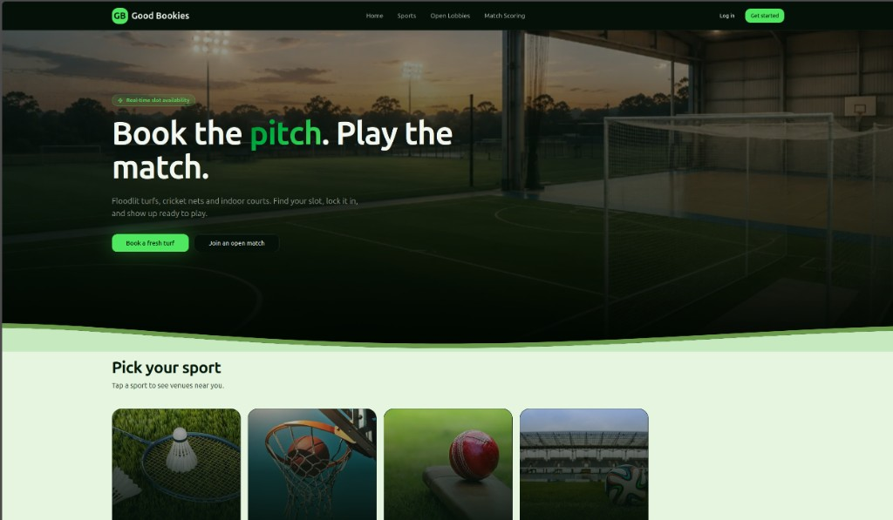

### Venue discovery — filter by sport, live ratings
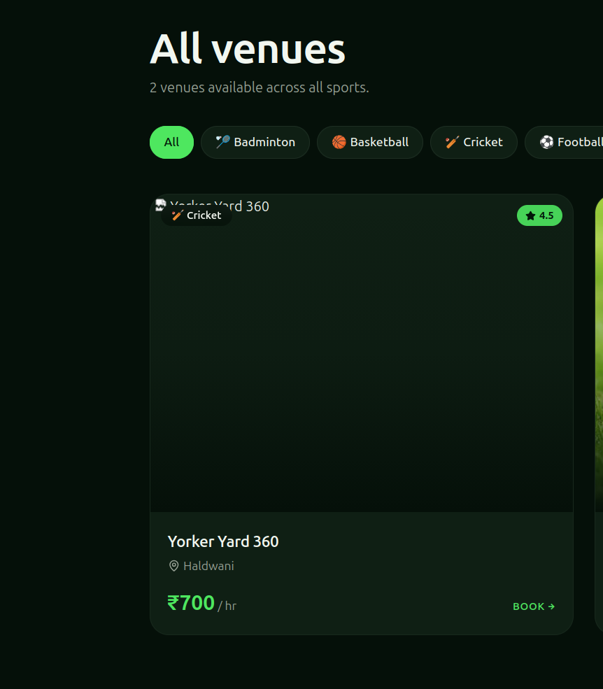

### Venue detail — media gallery, live slots, reviews
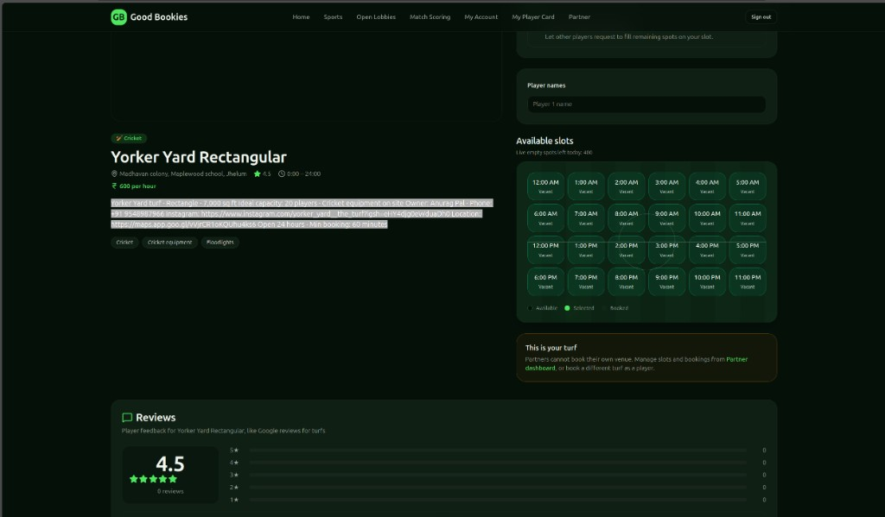

### Booking model — individual spot vs. full turf
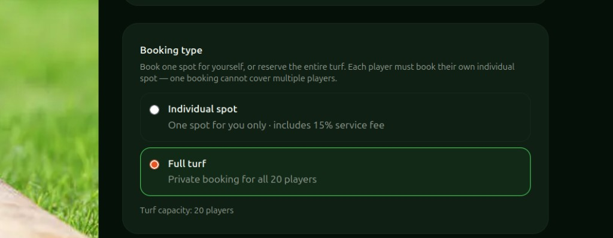

### Slot picker + payment portal — minute-precise, live price
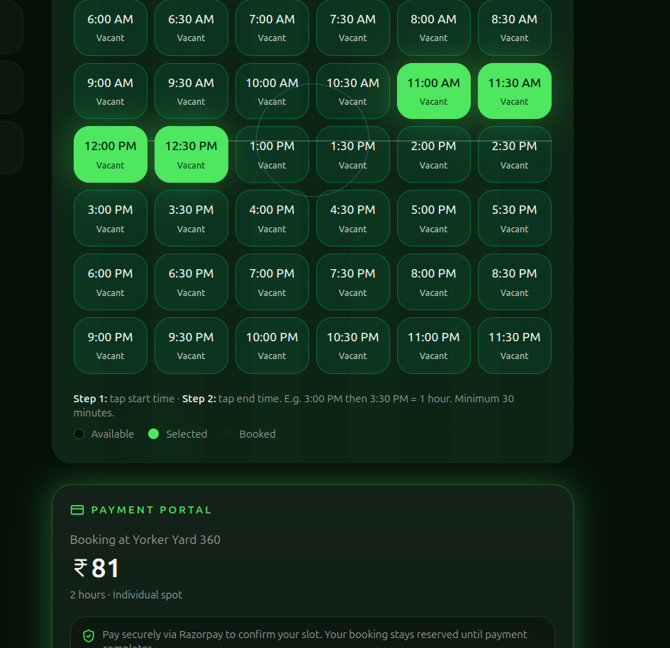

### Live slot board — see remaining spots at a glance
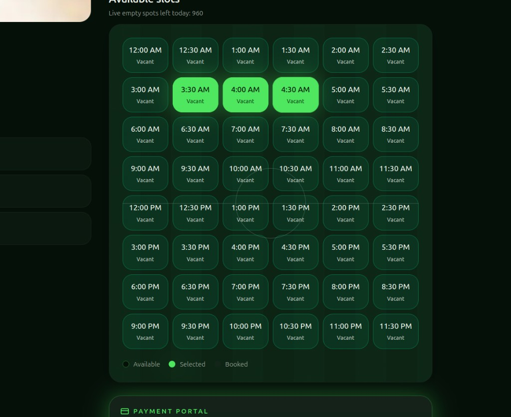

### Multi-sport player card builder — turf-verified stats
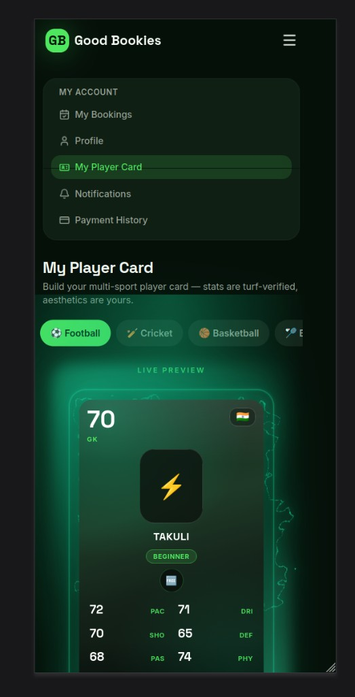

### Partner dashboard — venues, revenue, bookings, payouts
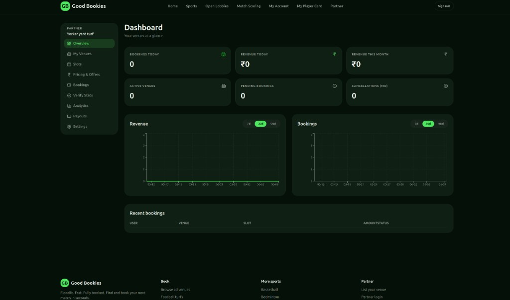

---

## 3. Tech Stack

| Layer | Technology |
|---|---|
| **Framework** | [TanStack Start](https://tanstack.com/start) (full-stack SSR) + [TanStack Router](https://tanstack.com/router) (file-based routing) |
| **UI** | React 19, TypeScript 5.8, Tailwind CSS v4, shadcn/ui (Radix primitives), Framer Motion, Lucide icons |
| **Data / RPC** | TanStack Query, `createServerFn` typed server functions, Zod validation |
| **Primary DB** | Supabase (PostgreSQL) + Row Level Security, Postgres triggers & functions |
| **Media DB** | Two Hostinger MySQL instances (`mysql2`) — user avatars vs. venue media blobs |
| **Auth** | Supabase Auth (email/password), role-based access (`user`, `owner`, `admin`) |
| **Payments** | Razorpay (orders, signature verification, refunds) |
| **Build** | Vite 7, `@tanstack/router-plugin`, `@tailwindcss/vite` |
| **Hosting** | Hostinger Node.js (custom `server-hostinger.mjs`), `tsx` runtime for API routes |
| **CI/CD** | GitHub Actions build → committed `dist/` → Hostinger deploy |

---

## 4. System Architecture

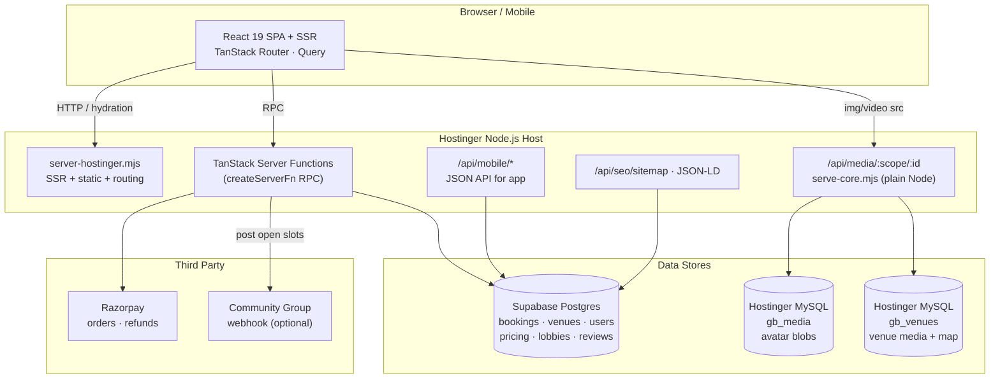

### Why split the database?

Storing binary media (large venue photos and short videos) in Postgres bloats backups, slows migrations, and burns Supabase storage/egress. Instead:

- **Supabase Postgres** holds only relational/transactional truth.
- **Hostinger MySQL `gb_venues`** stores venue image/video blobs in a `media_assets` table, with a `venue_media_map` table controlling **display order** (e.g. 3 photos then 1 video).
- **Hostinger MySQL `gb_media`** stores user avatar blobs, isolated from venue media.
- A single endpoint `GET /api/media/{scope}/{assetId}` streams the blob with correct MIME + caching. The handler (`api/media/serve-core.mjs`) is **plain Node.js** so it never depends on the `tsx` runtime in production.

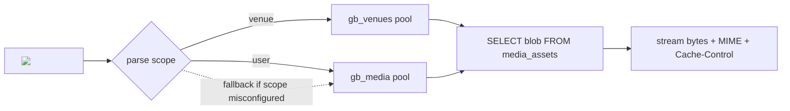

---

## 5. Data Model

Simplified core schema (Supabase Postgres). Media blobs live outside Postgres in MySQL.

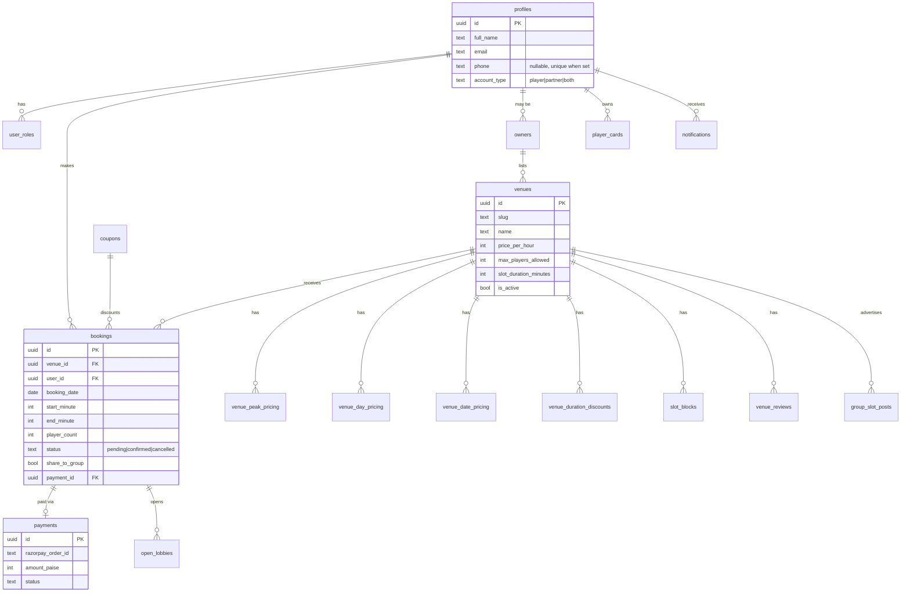

**Migration history** lives in `supabase/migrations/` (22 timestamped SQL files), covering: initial schema, owner onboarding, minute-based slots, capacity, open lobbies, multi-sport player cards, match scoring, venue reviews, dual player/partner roles, phone uniqueness, group slot posts, and deferring phone claim until email confirmation.

---

## 6. Key Flows

### 6.1 Booking + Payment (individual spot / full turf)

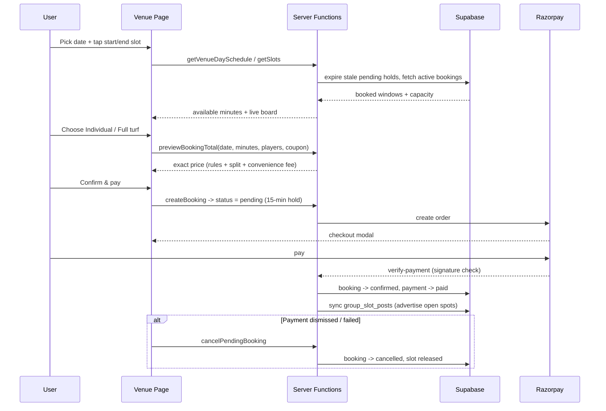

### 6.2 Pricing resolution

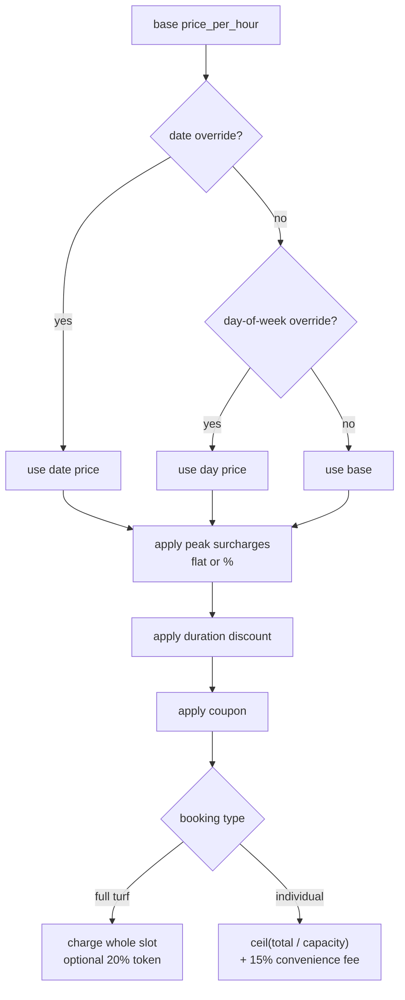

### 6.3 Auth, roles & the phone-uniqueness fix

Phone numbers are **unique**, but a naive trigger claimed the number the moment a Supabase `auth.users` row was inserted — even before email confirmation — which permanently locked the number if signup failed. The fix:

1. `handle_new_user` trigger inserts `profiles.phone = NULL` (no premature claim).
2. `releaseUnconfirmedPhoneHolders` clears stale claims from unconfirmed accounts on demand.
3. `claimMyPhone` server function writes the phone from auth metadata **after** confirmation, called from `useAuth` on session change.

---

## 7. Deep Dives

### Slot math (`src/lib/slot-time.ts`)
Times are stored as **minutes from midnight** (`0` = 12:00 AM, `750` = 12:30 PM). A booking is built from **two taps** (start + end), where the end tile is exclusive for billing — e.g. `11:00 AM → 12:30 PM = 90 min`. Supports 30- or 60-minute steps, contiguity checks, recurring/one-off slot blocks, and legacy hour-based rows.

### Pricing engine (`src/lib/pricing.ts`)
`calculateBookingTotal` walks each step-minute of the window, resolving the effective hourly rate (date > day > base, plus peak surcharges), then applies duration discounts and coupons. `resolvePayableAmount` derives what the user actually pays: full turf (whole slot, optional 20% token), or an individual spot (`ceil(total / capacity)` + 15% convenience fee). `previewBookingTotal` exposes this to the UI so the displayed price **always matches** the server's checkout math.

### Pending holds & slot release
Bookings start as `pending` with a **15-minute hold**. `expireStalePendingBookings` auto-cancels expired holds (and their payments) whenever slots are read, so an abandoned checkout never blocks a turf. Dismissing the Razorpay modal explicitly calls `cancelPendingBooking`.

### Cancellation & refunds (`src/lib/cancellation-policy.ts`)
Tiered policy: **≥24h → 100%**, **12–24h → 50%**, **<12h → no refund**, with a **10% convenience fee** deducted on refunds. `refundPaiseForCancellation` computes the exact refund, issued back through Razorpay.

### Media pipeline
Upload scripts (`scripts/upload-*-media.mjs`) push local files into MySQL `media_assets`, then register ordering in `venue_media_map`. The frontend resolves gallery items via `listVenueMediaBySlug` and renders them in a carousel (`VenueMediaGallery.tsx`) — 3 images then 1 video.

### Community group auto-posting
When a booking leaves open spots and the user opts in (`share_to_group`), `group_slot_posts` is upserted and (optionally) pushed to a `WHATSAPP_GROUP_WEBHOOK_URL`, so other players can fill remaining spots. Capacity updates re-sync the same post.

### Other features
- **Open lobbies** — join partially-filled matches.
- **Overlap suggestions** — if your window collides with an existing booking, suggest joining that game or booking the nearest free slot.
- **Live match scoring** — cricket & football scorers.
- **Multi-sport player cards** — FIFA/FUT-style cards with turf-verified stats, shareable as images.
- **SEO** — SSR meta, Open Graph, JSON-LD structured data, dynamic sitemap.
- **Mobile JSON API** — `/api/mobile/*` endpoints for a companion app.

---

## 8. Deployment / CI/CD

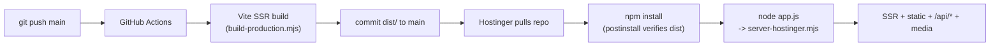

- **`server-hostinger.mjs`** serves static assets, `/api/mobile/*`, `/api/media/*`, SEO routes, and SSR for everything else.
- API routes run via the **`tsx`** ESM loader, registered lazily; media serving deliberately uses a **plain `.mjs`** handler to avoid `tsx` runtime issues in production.
- The build is **committed** (`dist/`) so the host can boot without a build step; `verify-dist.mjs` guards integrity and a `deploy-heartbeat.mjs` logs lifecycle events.
- Secrets (Supabase keys, Razorpay keys, MySQL credentials) are provided as host **environment variables**, never committed.

---

## 9. Engineering Highlights

- **Split polyglot persistence** — Postgres for relations, MySQL for blobs, unified behind one media API with graceful scope fallback.
- **Price integrity** — a single source of truth (`pricing.ts`) shared by preview and checkout, eliminating client/server drift bugs.
- **Race-safe inventory** — pending holds with auto-expiry and explicit release keep slot availability truthful under abandoned checkouts.
- **Correctness-first bug fixes** — phone-uniqueness lock, payment/time mismatch, and "cancelled payment still booked" all traced to root cause and fixed at the data layer.
- **SSR on commodity hosting** — TanStack Start running on a plain Node.js host with a hardened custom server, no serverless lock-in.
- **Type-safe end to end** — TypeScript + Zod-validated server functions from DB to UI.

---

## 10. Repository Map

```
src/
├── routes/            # File-based routes (public, account, owner, admin, scoring)
│   ├── index.tsx              # Landing (SSR hero, sport picker)
│   ├── sports.tsx             # Venue discovery
│   ├── venues.$slug.tsx       # Venue detail, slots, booking, payment
│   ├── lobbies.tsx            # Open match lobbies
│   ├── account.*              # Bookings, profile, player card, payments
│   ├── owner.*                # Partner portal (venues, pricing, slots, payouts, analytics)
│   ├── admin.*                # Admin (approvals, users, payments, analytics)
│   └── scoring.*              # Live match scoring
├── lib/               # Server functions + domain logic
│   ├── booking.functions.ts   # getSlots, createBooking, previewBookingTotal, holds
│   ├── pricing.ts             # Pricing engine + payment split
│   ├── slot-time.ts           # Minute math
│   ├── slot-schedule.ts       # Day sessions + overlap suggestions
│   ├── group-slot-posts.ts    # Community auto-posting
│   ├── cancellation-policy.ts # Refund tiers
│   ├── auth.functions.ts / phone.server.ts   # Auth, phone claim
│   ├── payment.functions.ts   # Razorpay orders/verify/refund
│   ├── player-card.*          # Multi-sport cards
│   └── media/mysql.server.ts  # MySQL blob storage + retrieval
├── components/        # UI (venue, payments, player, scoring, seo, shadcn/ui)
├── hooks/             # useAuth, etc.
└── integrations/      # Supabase clients (browser + admin)

api/                   # Plain endpoints (media serve, mobile JSON API, SEO sitemap, payments)
supabase/migrations/   # 22 SQL migrations
scripts/               # Build, deploy, media upload, provisioning
server-hostinger.mjs   # Production SSR + routing server
```

---

*Built by Aditya. Good Bookies — book the pitch, play the match.*
